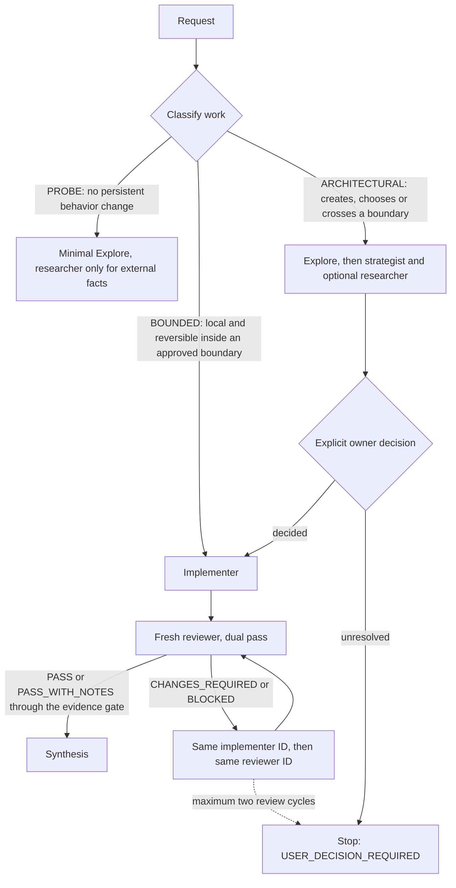

<p align="center">
  
</p>

<p align="center">
  <a href="LICENSE"></a>
  <a href=".cursor-plugin/plugin.json"></a>
  <a href="docs/installation-architecture.md"></a>
  <a href="https://github.com/iamsterling/curiosity-cursor-plugin/actions/workflows/ci.yml"></a>
  <a href="docs/testing/cursor-live-smoke-plan.md"></a>
</p>

# Curiosity Cursor Plugin

A public MIT-licensed, Cursor-only, file-only plugin for evidence-based software delivery.

It answers one question: **when an agent says the work is done, what makes that believable?** The answer here is structural rather than stylistic — separate the authority to decide from the authority to write, make every substantive result carry a compact, falsifiable receipt, and let reproducible evidence plus an independent review decide completion.

The whole product is Markdown and MDC. There is no runtime, hook, MCP server, SDK, installer, daemon, state store, or executable asset; installed use requires only Cursor.

## Quick start

Keep this plugin root separate from the target workspace. Cursor documents local loading in its plugin and CLI references; one supported shape is:

```sh
git clone https://github.com/iamsterling/curiosity-cursor-plugin.git
agent --workspace <target-project> --plugin-dir <path-to-this-checkout>
```

Then, inside the target workspace, run the command:

```text
/curiosity-deliver-change add rate limiting to the public upload endpoint
```

Stay in **Agent mode** — a writable hierarchy needs it, and Ask/Plan cannot be expected to elevate a writable child. Authentication, workspace trust, model availability, and tool permissions remain Cursor host concerns.

## Architecture and authority

<p align="center">
  
</p>

| Role | Access | Owns | Model preference |
| --- | --- | --- | --- |
| **Main agent** | orchestrates only | intent, routing, decisions, synthesis | your Cursor selection |
| **Explore** (built in) | read-only | broad repository discovery | host built-in |
| `curiosity-strategist` | read-only | consequential architecture decisions | `grok-4.6` |
| `curiosity-researcher` | read-only | external, version-sensitive evidence | `grok-4.6` |
| `curiosity-implementer` | **sole writer** | one bounded, test-first change | `composer-2.5` |
| `curiosity-reviewer` | read-only | independent dual-pass verdict | `claude-sonnet-5` |

Model names are preferences. Cursor plan or policy may select a compatible fallback, so backend identity cannot be guaranteed.

> [!IMPORTANT]
> **Semantic prompt policy, not host enforcement.** The required invariant is that top-level main never edits project source and never runs project-mutating shell, and that the bounded implementer is the sole writable exception. Cursor cannot currently enforce that exact split, because children inherit the parent mode and tool envelope. The `readonly: true` frontmatter on the strategist, researcher and reviewer is a declaration; it does not by itself prove runtime denial, confidentiality, or network isolation. Everything in this repository is prompt-governed guidance, and every claim below should be read that way.

### Context flow

Parent-context quality is the optimization target. Broad searches, patch mechanics and raw logs are exactly the material that crowds out intent, criteria, evidence and review state — so they stay in the child that produced them. Main keeps pointers, capsules, agent IDs and verdicts; it does not absorb raw search or log history.

Governance seeds, not performance claims: handoff ≤900 words, specialist synthesis ≤1200, evidence capsule ≤150, receipt ≤180, agent replies target ≤350.

### Routing

Work is classified `PROBE`, `BOUNDED`, or `ARCHITECTURAL`. Classification may only escalate, never de-escalate.



The owner-decision sweep runs across public API and config, data and persistence and migration and retention, dependency and license and supply chain, security and privacy and trust, deployment and operations, compatibility and rollout, paid service and spend, and reversibility and rollback. No edit precedes an unresolved consequential choice.

## Role × skill composition

Agents carry authority; skills carry method. Keeping them separate is what stops the implementer from quietly selecting architecture, and keeps method out of four duplicated prompts.

| Skill | Bound to | Method it owns |
| --- | --- | --- |
| `curiosity-implementation-discipline` | implementer | test-first minimal change, typed statuses and reason codes, the canonical `EVIDENCE_CAPSULE` |
| `curiosity-architecture-awareness` | implementer | pre-edit boundary detection and the Architecture Boundary Card — detects, never selects |
| `curiosity-decision-design` | strategist | decision frame, 2–4 viable options, reversibility register, falsifier, ADR disposition |
| `curiosity-research-evidence` | researcher | claim taxonomy (`FACT`, `VENDOR_CLAIM`, `ACADEMIC_FINDING`, `INFERENCE`, `UNKNOWN`), triangulation, bounded stopping |
| `curiosity-independent-review` | reviewer | dual-pass review and evidence-origin labelling |

`REQUIRED SKILLS` is a semantic prompt contract. Cursor documents no programmatic per-handoff skill attachment for these assets, so a role that cannot find its skill returns `BLOCKED` with `SKILL_UNAVAILABLE` rather than improvising the method.

## Evidence and evaluation philosophy

**The Curiosity Gate and Receipt.** Every substantive child result — including built-in Explore — ends with a `CURIOSITY_RECEIPT`: ten ordered fields covering classification, frame, probe, evidence, outcome, decision impact, material unknowns, curiosity pass, stop reason and confidence, in at most 180 words. Before any phase advances, main rejects missing, malformed, weak, contradictory or unsupported receipts and resumes the *same* child ID for one bounded repair. Twice inadequate blocks. Contradictions are resolved by raw evidence and one discriminating probe, never by voting. `material_unknowns: none` is treated as an evidenced affirmative claim.

**Evidence capsules.** The implementer returns separate `RED`, `GREEN` and `VERIFY` capsules, each at most 150 words: criterion, phase, origin, command or artifact, exit status, expected, observed, anchor, limitations. Raw logs stay child-local; only the decisive excerpt travels.

**Dual-pass review.** A fresh reviewer checks criteria and spec compliance first, then correctness, maintainability, test quality, security and boundary quality. It labels every piece of evidence by origin, so independently executed checks are never confused with audited claims. Passing verdicts are exactly `PASS` and `PASS_WITH_NOTES`, and only through the canonical evidence gate: every mandatory criterion `PASS`, no raw failure, no criterion-, security-, or decision-affecting material unknown, and no mandatory criterion resting on `UNVERIFIED_SUMMARY`. Todo state is never proof.

**What is actually verified today.** Repository checks validate the pinned Cursor manifest schema, the exact installed surface, policy wording, file safety, provenance and secrets. Seven static behavioral fixtures — blocking ambiguity, false root cause, hidden criterion, disguised architecture, blind retry, security boundary and context compression — validate authored contract shape only. **The live behavioral smoke plan has not been executed.** Live prompt adherence, host permission enforcement, model identity and fallback, child resumption and nesting behavior therefore remain open uncertainties, recorded in [`docs/testing/cursor-live-smoke-plan.md`](docs/testing/cursor-live-smoke-plan.md).

## Project structure

```text
.cursor-plugin/plugin.json   Cursor manifest: 4 agents, 5 skills, 1 command, 1 rule
agents/                      role authority prompts
skills/                      one SKILL.md per composable method
commands/                    /curiosity-deliver-change routing and sequencing
rules/                       always-applied Curiosity protocol and gates
docs/                        architecture, ADRs 0027-0030, spec, research, testing, assets
provenance/                  historical imports, manifests, hashes, evidence
tests/ tools/                repository-only static verification (never installed)
```

## Limitations

- Prompt policy is not host enforcement; the main no-edit boundary and the read-only declarations are not capability guarantees.
- No live Cursor behavioral smoke has been run, so live compliance is unproven.
- Model pins are preferences and may fall back silently under plan or policy.
- Static fixtures test authored contracts, not agent behavior.
- Skill requirements are semantic; there is no documented attachment API to rely on.
- Ask and Plan modes cannot be expected to grant a writable child.

## Target-project dependency policy

The plugin never installs or downloads its own runtime, tooling, SDK, package manager, or dependencies. The assigned implementer may add a dependency to the target project only after explicit user approval of the exact package, its purpose, prod/dev scope, the project-owned package-manager command, and expected manifest and lockfile changes. Use only the project's existing or documented manager and manifests. Never install globally, guess a manager, substitute `npx`, or use a curl-pipe bootstrap. Stop on ambiguity, and record command output and status, resulting diff, and verification.

## Development verification

```sh
bun install --frozen-lockfile
bun run verify
```

`verify` runs the Node test suite, the provenance verifier, and the secret scan. `package.json` retains `"private": true` solely as an npm publication interlock; it does not describe the visibility of this public Git repository. Do not publish, release, globally install, or cut over from this checkout without a separately reviewed change.

## Documentation

| Topic | Where |
| --- | --- |
| Current architecture | [`docs/architecture/current-state.md`](docs/architecture/current-state.md) |
| Normative behavior contract | [`docs/specs/vanilla-cursor-native-orchestration.md`](docs/specs/vanilla-cursor-native-orchestration.md) |
| Decisions | [ADR 0027](docs/decisions/0027-cursor-only-product-boundary.md) · [0028](docs/decisions/0028-hierarchical-context-preservation.md) · [0029](docs/decisions/0029-bounded-curiosity-as-foundational-policy.md) · [0030](docs/decisions/0030-role-authority-and-composable-expertise.md) |
| Canonical protocol | [`rules/curiosity-delivery.mdc`](rules/curiosity-delivery.mdc) |
| Installation model | [`docs/installation-architecture.md`](docs/installation-architecture.md) |
| Evaluation | [`docs/testing/behavioral-evals.md`](docs/testing/behavioral-evals.md) · [`docs/testing/cursor-live-smoke-plan.md`](docs/testing/cursor-live-smoke-plan.md) |
| Research synthesis | [`docs/research/role-authority-and-composable-expertise-2026-08-16.md`](docs/research/role-authority-and-composable-expertise-2026-08-16.md) |

## Provenance and license

Released under the [MIT License](LICENSE). Historical imported material remains attributed under [`provenance/`](provenance/) with reproducible manifests and digests; it is provenance, not a current product or compatibility promise. See [`docs/provenance.md`](docs/provenance.md).
